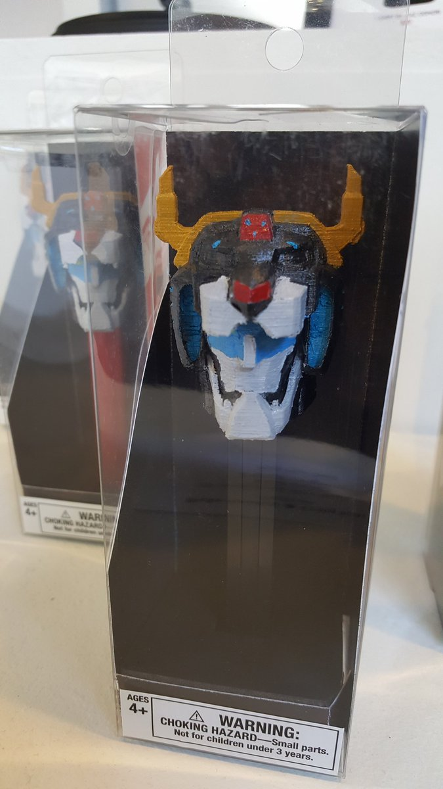

# dispenser

A dispenser of wisdom (and events).

> You're not really famous until youre a Pez dispenser.
>
> ― Carrie Fisher

## TODOs

- Deal with event versioning
  - Custom serialization?

- Get projection as of a specific eventNumber
  - keep the current event number in a state in the monadic projections?

- Eliminate all usages of panic/notImplemented/undefined.

- Eliminate all TODOs in code.

## In Progress

- Aggregates / Commands / source of truth

- Eliminate BatchedStream's 1 second delay thing (or eliminate BatchedStream altogether)

## Open Questions

- Event changes / versioning

- Business logic changes / versioning

- What happens if you don't consume a push stream fast enough?

- Resource finalization, not leaking postgres connections

- What happens when you record duplicate events? (two copies of the same bot running)

- What happens when you miss events that you can reconstruct later? (bot was down,
  but can use API to catch up)

